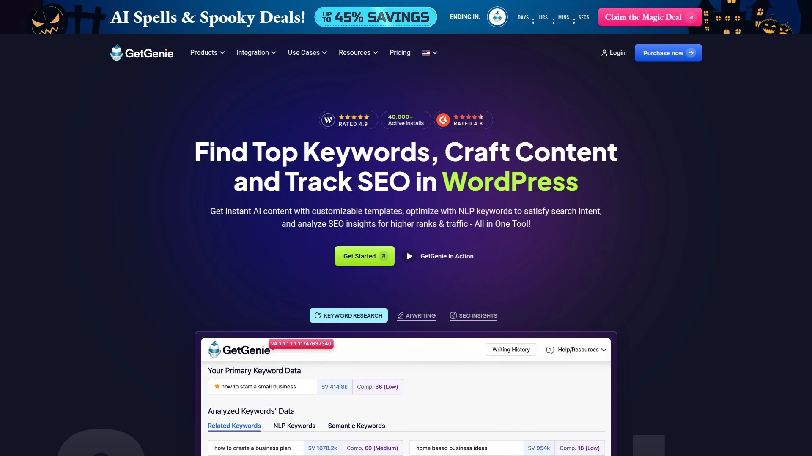
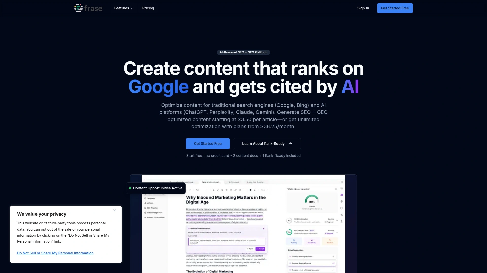
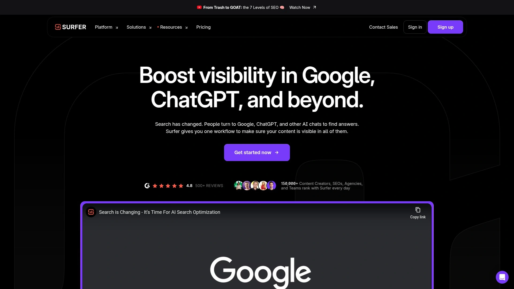
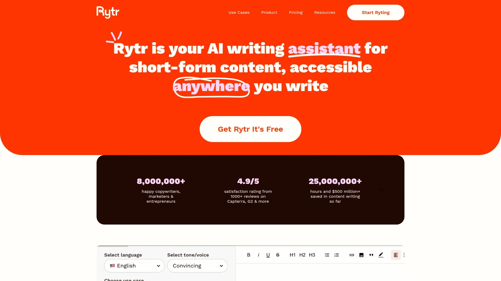
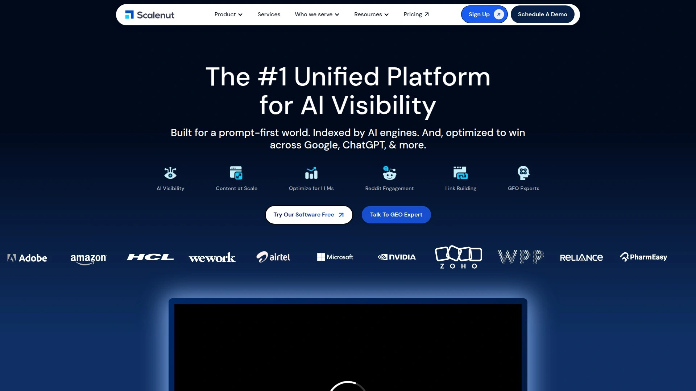
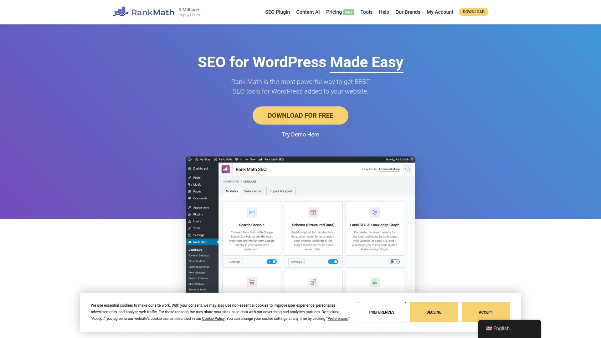
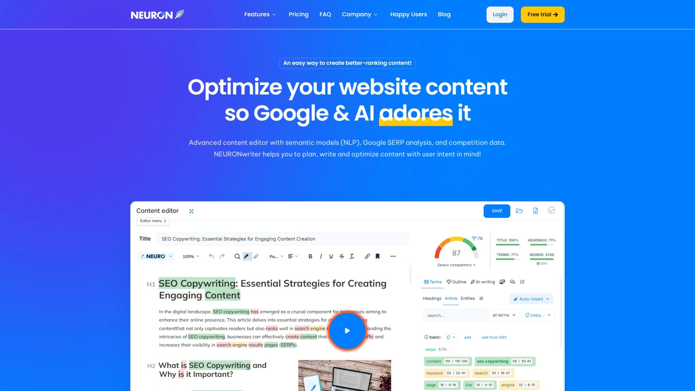
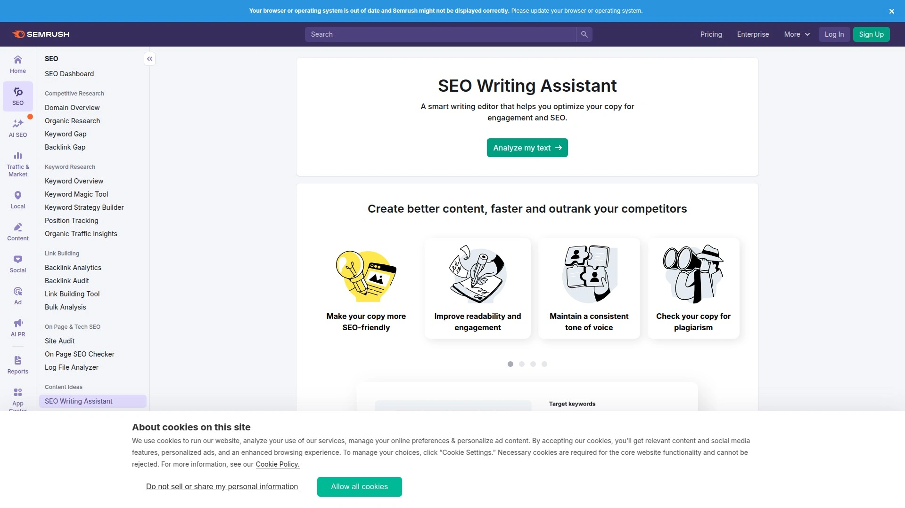

# 2025年最值得推荐的15款AI内容创作工具

做内容营销的人都懂,写文章、优化SEO、分析竞品这些活儿加起来能把人累成狗。关键词研究工具用一个,写作助手又是另一个,优化分数还得跳到第三个平台去看。来回切换不说,每个月订阅费加起来也是一笔不小的开支。好消息是,现在有一批AI工具把这些功能整合到一起了,从构思、写作到发布一条龙搞定,效率能提升好几倍,成本还能省一半。

## **[GetGenie](https://getgenie.ai)**

WordPress生态里的AI全能助手

GetGenie最聪明的地方在于它直接长在WordPress后台里,你不需要在多个标签页之间来回跳转。写文章的时候,右侧面板就能实时显示SEO评分、关键词密度、竞品分析,改一句话分数立马更新。它内置的NLP分析功能特别实用,会告诉你Top10页面都用了哪些语义关键词,你照着补上去排名就能往上走。关键词研究这块也省心,不像其他工具给你列一堆无用数据,GetGenie只显示真正相关的搜索词和问题,直接拿来当标题和小标题用。

**AI写作模板**覆盖博客文章、产品描述、社交媒体文案等场景,你可以选择一键生成完整内容,也可以分段慢慢写让AI辅助填充。生成的内容不是那种一眼就看出来是机器写的废话,而是真的能用,稍微改改就能发布。SERP追踪功能会持续监控你发布内容的排名变化,哪些关键词掉了、哪些词排上去了一目了然,方便你及时调整策略。Genie Image功能最近也加进来了,能用AI生成配图,省得再去找素材。

定价方面有免费版可以试用,付费计划从每月39美元起,对于既需要SEO分析又需要内容生成的WordPress用户来说,这个价格比分别订阅多个工具划算太多。特别适合数字营销人员、内容团队和需要批量产出SEO文章的代理商。用户普遍反馈它的WordPress集成体验很流畅,客服响应也快,遇到问题基本当天就能解决。

## **[Jasper AI](https://www.jasper.ai)**

内容营销的老牌选手

Jasper在AI写作工具里算是最早一批做起来的,功能打磨得很成熟。它有50多个内容模板,从AIDA广告框架到PAS销售文案,从产品描述到创意故事,基本涵盖了你能想到的所有文案场景。Jasper的Boss Mode(高级模式)特别强大,你可以像跟真人助理对话一样给它下指令,比如"把这段话改得更有说服力"或者"用轻松幽默的语气重写一遍",它都能理解并执行。

**品牌声音定制**是Jasper的一大亮点。你可以上传自己过往的文章或者设置品牌调性参数,Jasper学习之后生成的内容就能保持统一风格。这对需要维护品牌形象的企业特别重要,不会出现今天的文章像个严肃专家、明天又变成网红口吻的尴尬情况。它和Surfer SEO有集成,可以一边写一边看SEO优化建议,不过这需要额外付Surfer的订阅费,整体成本会高一些。

Jasper支持团队协作,多人可以共享模板、品牌设置和内容库,适合规模稍大的内容团队。缺点是没有免费计划,起步价每月39美元,对于个人用户或者刚起步的小企业可能有点肉疼。但如果你看重内容质量和品牌一致性,愿意为更好的控制力付费,Jasper值得投资。用户反馈它的学习曲线适中,模板设计得很直观,新手花几个小时就能上手。

## **[Writesonic](https://writesonic.com)**

SEO优化的性价比之王

Writesonic最大的杀手锏是把SEO工具直接内置进来了,不需要像Jasper那样再去买Surfer的订阅。它和Semrush、Ahrefs集成,写文章的时候能实时拉取关键词数据和SERP分析,告诉你Top10页面的平均字数、标题结构、常用词汇。你照着这些数据写,内容自然就符合搜索引擎的口味。Article Writer 6.0版本特别智能,可以一次性生成3000字的长文,而且逻辑连贯、段落分明,不是那种拼凑感很强的机器文。

**AI Agents功能**是Writesonic最近推出的自动化特性,可以设置工作流让它定期生成内容、分析竞品、更新旧文章。比如你可以设定每周自动生成3篇关于某个主题的博客草稿,早上打开后台就能看到待编辑的内容,省去了从零开始构思的时间。它还有品牌声音定制,不过相比Jasper的灵活性稍弱一些,更适合需要快速产出而不是深度定制的场景。

定价非常亲民,有免费计划提供25个一次性积分让你试用,付费版从每月16美元起(年付),比Jasper便宜一半以上。对于预算有限但又想要全套SEO+写作功能的创业者、博主和小型企业来说,Writesonic是最实惠的选择。界面设计简洁,功能虽多但组织得清晰,不会让人感觉眼花缭乱。用户评价它生成博客文章的质量很稳定,特别是资讯类、教程类内容基本不需要大改。

## **[Frase](https://frase.io)**

从研究到写作的一站式方案

Frase的工作流程设计得特别顺,先帮你做SERP研究,抓取Top20页面的内容大纲、常见问题、关键统计数据,然后基于这些信息自动生成内容简报(Brief)。你拿到这个简报就知道该写哪些部分、回答哪些问题、引用什么数据,相当于有个研究助理帮你把前期工作都做了。接着你可以用AI一键生成初稿,或者在编辑器里自己写,右侧面板会实时显示优化评分和缺失的话题点。

**内容优化器**会用A-F等级给你的文章打分,告诉你哪些地方需要补充、哪些词用得太多、标题结构是否合理。这比单纯看个数字分数更直观,你能清楚知道怎么改才能提分。Frase还有个独特功能是"People Also Ask"集成,直接把Google搜索结果里的相关问题抓过来,你可以在文章里专门设置FAQ部分回答这些问题,既丰富了内容又提高了排名潜力。

价格从每月45美元起,算是中等水平。Frase有免费入口让你先试用基础功能,适合独立创作者、SEO专家和小型内容团队。用户普遍认为它的学习曲线很友好,即使是SEO新手也能快速理解怎么用数据指导写作。不足的地方是Google Docs插件功能有限,更推荐直接在Frase的编辑器里工作。整体来说,如果你希望把研究、写作、优化整合在一个工具里,Frase是最平衡的选择。

## **[Surfer SEO](https://surferseo.com)**

实时优化的写作伴侣

Surfer在内容优化领域算是标杆级产品,最核心的价值是它的实时评分系统。你一边写一边就能看到内容分数的变化,加一个关键词分数涨了,删一段话又掉了,这种即时反馈让优化过程变得像玩游戏一样有目标感。它分析Top10页面后会给出非常具体的建议,比如"文章应该在2500-3200字之间""标题里至少出现3次核心词""应该包含15-20个相关术语",你照着做基本就能进前三页。

**SERP Analyzer**功能能深度解析竞品内容结构,显示他们的段落分布、图片数量、外链情况,你可以学习Top1页面的写作方式,避免闭门造车。Content Audit工具会定期检查你已发布的旧文章,告诉你哪些内容因为算法更新需要重新优化,避免排名无声无息地掉下去。Surfer还有Chrome插件和WordPress插件,可以在Google Docs或者WP编辑器里直接使用,非常方便。

起步价每月99美元,在专业SEO工具里算中等偏贵。Surfer没有免费计划,但可以申请演示或试用。它特别适合内容团队、SEO代理商和认真做排名的企业站,如果你只是偶尔写几篇文章,这个价格可能不太划算。用户反馈Surfer的优化建议精准度很高,按照它的指导写出来的内容排名提升明显。需要注意的是,Surfer主要做优化不做生成,你还是得自己写内容或者配合Jasper这类写作工具使用。

## **[Clearscope](https://www.clearscope.io)**

企业级的内容优化标准

Clearscope的用户体验是这批工具里最干净利落的,没有花里胡哨的功能,就专注把内容优化这一件事做到极致。它的NLP术语推荐特别精准,会根据Top10页面提取出最重要的概念和表达方式,你把这些词自然地融入文章里,相关性评分就能达到很高水平。评分系统用A-F字母等级,比单纯的数字更容易理解,而且会明确告诉你是标题问题、字数问题还是缺少关键话题。

**内容监控功能**是Clearscope的独家优势,它会自动追踪你所有已发布内容的SEO表现,一旦某篇文章因为算法更新或者竞品变化导致排名下滑,系统会发通知提醒你更新。这种主动维护机制能让你的内容资产保持竞争力,不会出现发布后就不管、排名慢慢掉到第三页的情况。Clearscope还支持无限座位,对于大型团队来说成本效益很高,不需要像其他工具那样按人头付费。

定价从每月189美元起,属于高端产品。没有免费试用,通常需要先和销售团队沟通了解需求再给报价。Clearscope的目标用户是企业内容团队、大型代理商和对内容质量有高要求的品牌,如果你是个人创作者或者小团队,这个价位可能超出预算。用户一致认为Clearscope的界面最友好、学习成本最低,新员工基本看一遍就会用。而且它的优化建议质量很高,不会给你一堆乱七八糟的关键词,每个推荐都有明确理由。

## **[MarketMuse](https://www.marketmuse.com)**

内容战略的智囊团

MarketMuse和其他工具最大的区别是它不只帮你优化单篇文章,而是站在网站整体战略的角度分析内容缺口。它会扫描你的整个站点,告诉你哪些主题你已经有权威性、哪些领域还是空白、竞品在哪些话题上比你强。然后给出一个主题集群规划,建议你按什么顺序创建内容、每篇文章应该覆盖哪些子话题、内部链接怎么搭建。这种宏观视角对想系统性做内容的企业特别有价值。

**Topic Modeling技术**是MarketMuse的核心,它不只是简单的关键词匹配,而是理解话题之间的语义关系。比如你写一篇关于"内容营销"的文章,它会建议你同时创建"内容日历""SEO写作""内容分发"等相关主题的文章,形成一个完整的知识体系,这样搜索引擎会认为你在这个领域有深度,给你更高权重。自动生成的内容简报非常详细,包括应该回答的问题、需要引用的数据类型、建议的文章结构。

MarketMuse的起步价每月99美元,高级功能需要更贵的套餐。它有免费层级可以体验基础功能,但要真正用起来还是得付费。学习曲线比较陡,新用户可能需要一两周才能摸清它的逻辑,而且有些用户反馈界面有点笨重、加载速度慢。MarketMuse更适合企业内容策略师、SEO总监这类需要规划全局的角色,如果你只是个写手想优化单篇文章,用Surfer或者Frase更直接。但如果你想搞清楚整个内容生态应该怎么布局,MarketMuse能给你答案。

## **[Copy.ai](https://www.copy.ai)**

短文案的效率神器

Copy.ai最初就是为营销文案而生的,所以在写广告语、社交媒体帖子、邮件主题行这些短内容上特别擅长。它有大量模板覆盖各种营销场景,像是产品发布公告、促销活动文案、视频脚本、着陆页标题等等。界面设计得很清爽,你选一个模板、输入几个关键信息,几秒钟就能生成十几个变体供你挑选。这种快速迭代的方式很适合需要大量测试不同文案版本的营销团队。

**编辑工具**包括语法检查、句子简化器、动词增强器,这些小功能在润色阶段特别有用。Copy.ai还有个独特的"Freestyle"模式,不用选模板,你直接和AI聊天式地说你想要什么内容,它就能根据上下文理解你的意图生成结果。不过Copy.ai在长文内容上表现一般,它更擅长500字以内的精炼表达,如果你要写3000字的深度文章,Jasper或者Writesonic会更合适。

定价从每月24美元起(年付),提供无限制的内容生成额度和项目数。有免费试用让你先体验功能,适合需要大量短文案的创业公司、电商卖家和社交媒体运营人员。用户反馈Copy.ai的生成速度很快、模板分类清晰,但有时候生成的内容会有点套路化,需要人工调整才能显得更自然。整体来说,如果你的核心需求是营销文案而不是SEO长文,Copy.ai是性价比最高的选择之一。

## **[Rytr](https://rytr.me)**

预算有限的入门首选

Rytr的最大卖点就是便宜。免费版每月有一定额度可以生成内容,付费无限版只要每月7.5美元,这个价格在AI写作工具里几乎找不到更低的了。虽然便宜,但功能该有的都有——40多个使用场景模板、25种以上语言、语气调整、内置抄袭检查器。对于个人博主、自由职业者或者刚开始尝试AI写作的用户来说,Rytr是风险最小的选择,不用一上来就投入几十美元试错。

**多语言支持**做得不错,如果你需要生成非英语内容,Rytr是少数几个能保证输出质量的工具之一。它还有内置的SEO分析器,虽然功能没有Surfer或者Frase那么强大,但对于基础的关键词优化足够用了。用户界面设计简单直观,没有复杂的设置选项,选模板、输入信息、生成内容,三步搞定,特别适合不想花时间学习的用户。

缺点是Rytr在长文生成和深度内容方面能力有限,超过1000字的文章经常需要你分段生成然后手动拼接,而且生成的内容有时候逻辑跳跃需要大量修改。它更像是个写作助手而不是完整解决方案,你还是得自己承担主要的写作和编辑工作。但考虑到这个价格,这些限制完全可以接受。如果你预算紧张又需要AI辅助,Rytr能帮你在不花大钱的情况下提升效率。

## **[Scalenut](https://www.scalenut.com)**

SEO全流程自动化平台

Scalenut的"Cruise Mode"功能特别有意思,你只需要输入一个关键词,它就能自动完成整个内容创作流程:研究关键词、分析竞品、生成大纲、写初稿、优化SEO。整个过程基本不需要人工干预,几分钟就能得到一篇完整的SEO文章。当然这种全自动生成的内容质量肯定不如人工精心打磨,但对于需要快速产出大量内容的场景——比如批量建站、内容农场——这个效率是其他工具比不了的。

**主题集群规划**功能类似MarketMuse,能帮你设计整个话题的内容矩阵,告诉你应该创建哪些支柱页面、哪些子页面,以及它们之间的链接关系。Scalenut的NLP分析会提取Top10页面的语义关键词,你照着覆盖这些词,内容相关性自然就上去了。实时SEO评分系统跟Surfer类似,边写边看分数变化,有明确的优化目标。

定价从每月49美元起,处于中等价位。Scalenut有免费试用和基础免费计划,适合需要批量生成内容的营销团队、代理商和出版商。用户反馈它的AI和SEO结合得不错,但界面有点复杂,新手可能需要一段时间适应。如果你重视速度和规模化产出,愿意在质量上做一些妥协,Scalenut的Cruise Mode能大幅减少你的工作量。但如果你追求每篇文章的精品质量,还是建议用Jasper或者Frase配合人工编辑。

## **[Rank Math SEO](https://rankmath.com)**

WordPress SEO的AI升级版

Rank Math本身就是WordPress上最受欢迎的SEO插件之一,现在加入了"Content AI"功能,把AI写作和SEO优化整合到一起。它会分析你目标关键词的Top10页面,给出实时的优化建议:字数应该是多少、用什么标题结构、应该包含哪些关键词。这些建议都基于真实的排名数据,不是凭空瞎猜,所以执行后效果很明显。Rank Math还有内置的关键词研究工具,可以直接在后台找相关词,不用再跳到其他平台。

**Schema标记生成**是Rank Math的强项,可以自动给你的文章添加结构化数据,提高在搜索结果里获得富摘要的机会。它还有性能追踪功能,监控你每篇文章的排名变化、点击量、展现量,所有数据都在WordPress后台一目了然。对于已经在用WordPress的用户来说,Rank Math比那些独立的第三方工具更方便,因为所有功能都无缝集成在你熟悉的编辑器里。

免费版提供5个Content AI积分让你试用,Pro版本从每年59美元起,这个价格非常友好。Rank Math的用户基数很大,社区活跃,遇到问题基本都能找到解决方案。唯一需要注意的是AI积分系统对新手可能有点绕,你需要理解积分怎么消耗、怎么充值。整体来说,如果你的网站是WordPress搭建的,而且想要一个既能做SEO分析又能辅助写作的插件,Rank Math是最省心的选择。

## **[GrowthBar](https://www.growthbar.com)**

一站式SEO和内容工具箱

GrowthBar把很多功能打包在一起:关键词研究、竞品分析、内容生成、网站审计,还有Chrome插件和WordPress插件。它的AI博客写手能根据你选的关键词自动生成完整文章,包括标题、大纲、各段落内容。虽然生成的内容可能不如专业工具那么精细,但作为初稿已经很不错了,你只需要补充一些个人观点和案例就能发布。

**Chrome插件**特别方便,你在Google搜索的时候,侧边栏就会显示这个关键词的搜索量、CPC、难度评分,还能看到Top10网站的域名权重和反向链接数。这让你做竞品研究的时候不需要在多个工具之间切换,一个页面搞定所有信息。GrowthBar还有内容优化器,不过功能相对基础,更适合SEO新手而不是资深从业者。

起步价每月48美元,提供7天免费试用。GrowthBar的定位是"广度优于深度",如果你需要的是一个涵盖SEO各个方面的入门工具,不追求每个功能都做到极致,GrowthBar的综合性价比很高。特别适合博主、独立站长和小型营销团队,这些用户通常一人身兼数职,需要一个能快速上手、覆盖全流程的工具。界面设计很友好,基本不需要学习就能使用。

## **[NeuronWriter](https://neuronwriter.com)**

多语言内容优化专家

NeuronWriter支持170种以上语言的内容优化,这在行业里是独一份的。如果你做国际化内容,需要优化西班牙语、德语、日语等非英语文章,NeuronWriter能提供跟英语内容一样精准的NLP术语推荐和SEO建议。它还有个有趣的功能是YouTube视频分析,可以从视频转录文本里提取关键话题和观点,如果你想把视频内容转化成博客文章,这个功能能节省大量时间。

**内容编辑器**包含实时SEO评分和关键词密度监控,跟Surfer的逻辑类似但价格便宜不少。NeuronWriter还会给出竞品内容的详细分析,包括他们的文章结构、标题层级、段落长度分布,你可以学习排名好的页面的写作模式。对于预算有限但又需要专业优化功能的中小企业和个人创作者来说,NeuronWriter是个平衡选择。

起步价每月19美元,属于低价区间。虽然便宜但功能不含糊,基本的SEO优化需求都能满足。学习曲线适中,界面没有太多复杂设置。用户反馈NeuronWriter在英语内容优化上跟其他主流工具差距不大,多语言支持则是它的独特竞争力。如果你只做英语内容,可能Surfer或者Frase更合适;但如果你的业务涉及多个语言市场,NeuronWriter能帮你用一个工具搞定所有语言的优化。

## **[Outranking](https://www.outranking.io)**

最详细的写作指导系统

Outranking的特色是它给的写作指导超级细致,不只是告诉你应该包含哪些关键词,还会建议每个段落应该写什么内容、用什么小标题、甚至哪些地方应该添加内部链接。它生成的内容大纲是逐步展开的,像是一个经验丰富的编辑在手把手教你怎么写。对于SEO写作经验不足的新手来说,这种详细指导能快速提升内容质量。

**内部链接建议**功能很实用,Outranking会分析你网站上的其他文章,告诉你应该在新内容的哪些位置链接到哪些旧文章,这样可以加强网站的内部链接结构,提升整体SEO表现。它还支持Featured Snippet优化,会识别哪些关键词有机会获得精选摘要,然后给出具体的格式建议,比如用列表、表格还是定义式回答。

定价从每月19美元起,首月有优惠可以7美元体验。Outranking的界面信息密度比较高,有些用户觉得有点拥挤,需要时间适应。它更适合那些愿意按照详细指导一步步优化内容的SEO写手,如果你喜欢自由发挥不想被框架限制,可能会觉得它太"啰嗦"。但如果你是那种"告诉我具体怎么做我就能做好"的执行型选手,Outranking的颗粒度是其他工具比不了的。

## **[Dashword](https://www.dashword.com)**

内容维护的长期伙伴

Dashword除了标配的内容优化功能,还特别强调内容的持续监控和维护。它会追踪你所有已发布文章的排名表现,一旦检测到某篇内容出现"衰退"迹象——比如排名持续下滑、流量减少——就会发送提醒通知,并且给出更新建议。这种主动维护机制能让你的内容资产保持活力,避免写完发布就不管、最后慢慢失去排名的情况。

**报告功能**很完善,可以生成内容表现的详细报告,展示哪些文章带来了最多流量、哪些关键词排名提升了、整体SEO健康度如何。这些数据对于向客户或者老板汇报工作特别有用,比单纯说"我们发了10篇文章"更有说服力。Dashword的内容编辑器包含基础的优化建议和术语推荐,虽然不如Clearscope或者Surfer那么精细,但对于日常维护够用了。

起步价每月39美元,有免费试用期。Dashword特别适合那些已经有一定内容积累、需要系统化管理和维护的博客、企业站和内容型网站。如果你的网站只有几篇文章,用Dashword可能有点大材小用;但如果你有几十上百篇内容需要持续优化,它的监控和报告功能能帮你把精力放在最需要关注的地方。用户反馈界面简洁易用,客服响应速度快。

## **[Semrush SEO Writing Assistant](https://www.semrush.com/swa/)**

Semrush生态的内容延伸

如果你已经在用Semrush做关键词研究和竞品分析,那SEO Writing Assistant是自然的补充。它和Semrush的数据库无缝连接,可以直接调用关键词数据、SERP分析、竞品内容策略。你在Google Docs或者WordPress里写文章的时候,侧边栏会实时显示SEO评分、可读性建议、语气一致性检查、抄袭检测。这种一站式体验对于Semrush的老用户来说特别方便,不需要再学一个新工具。

**可读性和语气分析**是Semrush Writing Assistant的特色,它不只关注SEO,还会评估你的内容是否易读、语气是否符合品牌定位。如果你设定的品牌语气是"专业严肃",它写得太随意的时候工具会提示你调整。抄袭检查器能确保你的内容是原创的,避免因为重复内容被搜索引擎惩罚。

SEO Writing Assistant包含在Semrush的Guru套餐里,起价每月249.95美元,这个价格主要是为Semrush的整体功能付费,单独为Writing Assistant订阅可能不划算。有免费试用和限制版本可以体验,适合已经是Semrush用户、想要扩展内容创作能力的营销团队和代理商。如果你不用Semrush的其他功能,单独选Frase或者Surfer会更经济。但如果你的工作流已经深度依赖Semrush,Adding Writing Assistant能让数据流转更顺畅。

## 常见问题

**AI写作工具生成的内容会被搜索引擎判定为低质量吗?**

关键不在于内容是AI写的还是人写的,而在于内容本身是否有价值、是否满足搜索意图。Google的算法识别的是内容质量和用户体验,不是创作方式。如果你用AI生成初稿后进行人工编辑,补充独特观点、实际案例和最新数据,这样的内容完全符合SEO标准。反而那些纯人工写但空洞无用的内容更容易被降权。诀窍是把AI当助手而不是替代品,用它提升效率但不放弃人工把关。

**这些工具能完全替代专业SEO和内容团队吗?**

不能。工具擅长的是数据分析、竞品研究、快速生成框架,但战略思考、创意构思、品牌声音塑造这些需要人类智慧的部分,AI还做不到。最好的使用方式是让工具承担重复性的基础工作——比如关键词研究、竞品分析、初稿生成,把团队的时间解放出来专注于策略规划、深度编辑和效果优化。一个熟练使用AI工具的小团队,生产力可以顶得上过去两倍人数的传统团队,但完全无人化目前还不现实。

**选工具应该优先看什么指标?**

先明确你的核心需求。如果你是WordPress用户且希望一体化解决方案,GetGenie和Rank Math这类原生插件最方便;如果预算紧张想要性价比,Rytr和NeuronWriter的低价套餐足够入门;如果追求内容质量和品牌一致性,Jasper的定制化能力更强;如果SEO排名是第一优先级,Surfer和Clearscope的优化精准度最高。别被功能清单迷惑,90%的用户只会用到20%的功能,选一个符合你实际工作流、学习成本可接受的工具,比堆砌功能重要得多。

## 总结

做内容营销说到底拼的是效率和质量的平衡,AI工具恰好能在这两者之间搭桥。从这份清单来看,[GetGenie](https://getgenie.ai)对于WordPress用户来说是最顺手的选择,它把关键词研究、内容生成、SEO优化、SERP追踪全部整合在你熟悉的后台里,不需要在多个平台之间跳来跳去打断思路。特别是那个实时优化评分,改一句话分数立马变化,这种即时反馈让内容优化变得像玩游戏一样有目标感。配合它的NLP分析和竞品数据,即使是SEO新手也能快速产出符合排名标准的内容。
